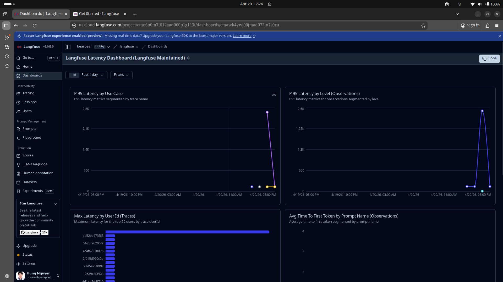
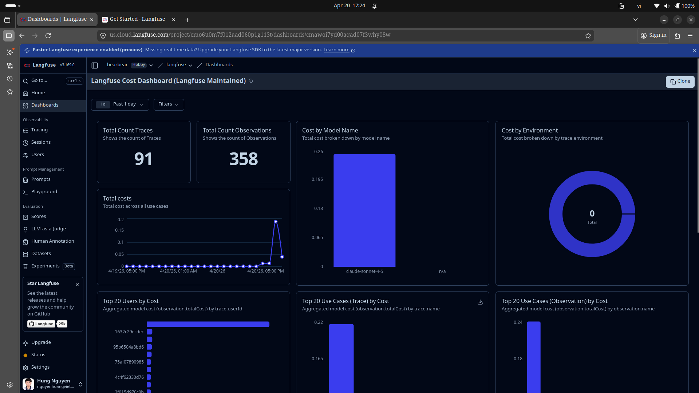
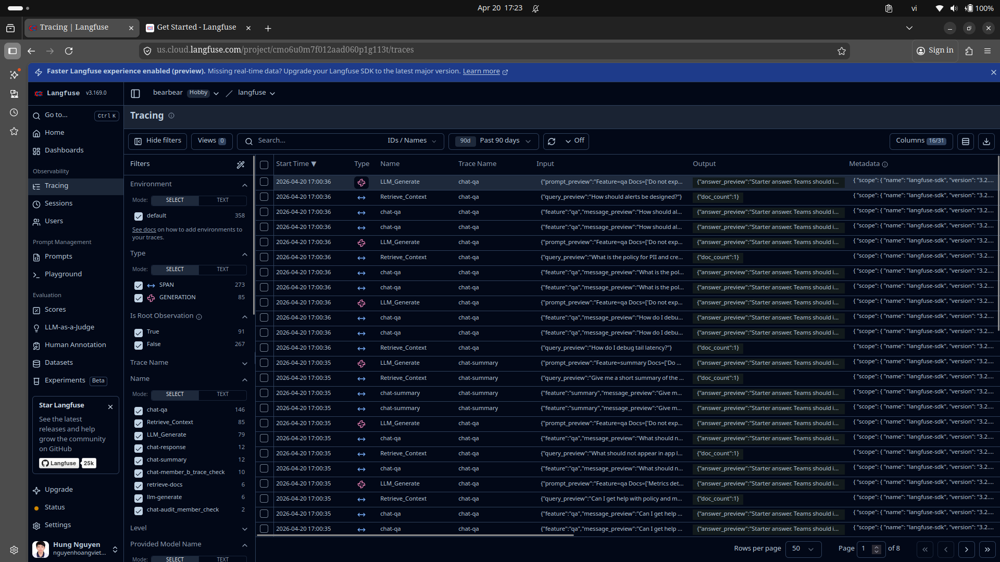
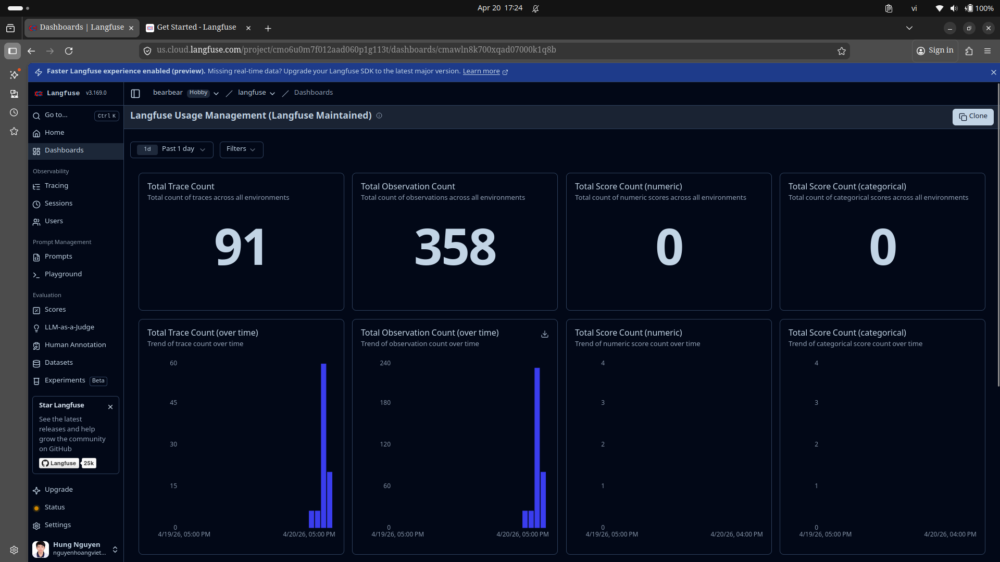
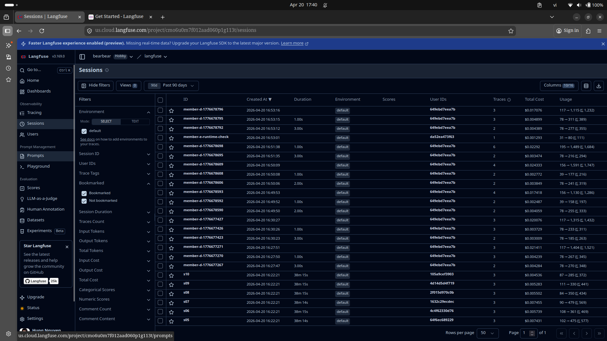

# Dashboard Spec - Final (Nhom08_402_13)

Tai lieu nay mo ta dashboard chinh thuc dung de demo va cham diem, dong bo voi rubric Day 13 va cau hinh SLO/Alerts trong he thong.

## A. Dashboard inventory (6 panels)

### 1) Latency (P50/P95/P99)
- Muc tieu: theo doi do tre tong the va tail-latency.
- Metric keys: `latency_p50`, `latency_p95`, `latency_p99`
- Unit: ms
- Threshold/SLO line: `latency_p95 <= 3000ms`
- Evidence screenshot: 

### 2) Traffic (Request volume)
- Muc tieu: theo doi luong request de doi chieu throughput va stress test.
- Metric keys: `traffic`
- Unit: count
- Nguon: endpoint `/metrics` + load test output

### 3) Error Rate & Error Breakdown
- Muc tieu: phat hien suy giam reliability.
- Metric keys: `error_rate_pct`, `total_errors`, `error_breakdown`
- Unit: % / count
- Threshold line: alert warning tu 5% (`high_error_rate`), objective SLO < 2%

### 4) Cost Over Time
- Muc tieu: quan tri chi phi AI va phat hien burn-rate bat thuong.
- Metric keys: `hourly_cost_usd`, `daily_cost_usd`, `avg_cost_usd`
- Unit: USD
- Evidence screenshot: 

### 5) Token Usage (Input/Output)
- Muc tieu: theo doi token de toi uu prompt va cost.
- Metric keys: `tokens_in_total`, `tokens_out_total`
- Unit: count

### 6) Quality/Security Proxy
- Muc tieu: theo doi chat luong tra loi va an toan du lieu.
- Metric keys: `quality_avg` + `pii_hits` (tu `scripts/validate_logs.py`)
- Unit: score / count

---

## B. Supporting dashboards/screens

- Tracing operations: 
- Usage management (trace/observation totals): 
- Sessions monitoring: 

---

## C. Mapping panel -> runtime source

| Panel | Runtime source | Formula/Meaning |
|---|---|---|
| Latency | `/metrics` | p50/p95/p99 tren `REQUEST_LATENCIES` |
| Traffic | `/metrics` | tong so request da record |
| Error | `/metrics` | `error_rate_pct = total_errors / traffic * 100` |
| Cost | `/metrics` | tong va trung binh chi phi theo request |
| Tokens | `/metrics` | tong token vao/ra cua mo hinh |
| Quality/Security | `/metrics` + `validate_logs.py` | `quality_avg` + PII leak count |

---

## D. Latest runtime snapshot (for report)

- traffic: 57
- latency_p95: 170 ms
- error_rate_pct: 1.754%
- daily_cost_usd: 0.1231
- tokens_in_total: 1973
- tokens_out_total: 7809
- quality_avg: 0.8702

Note: Snapshot duoc cap nhat sau khi chay load test on dinh de phuc vu phan demo va bao cao.

---

## E. Quality bar checklist

- [x] Du 6 panels theo rubric.
- [x] Co unit ro rang (ms, %, USD, count, score).
- [x] Co threshold/SLO line cho panel quan trong.
- [x] Co evidence screenshot trong `docs/static`.
- [x] Co mapping metric key de doi chieu voi SLO/alerts.

## F. Demo sequence (dashboard section)

1. Mo `dashboard_latency.png` va giai thich SLO line 3000ms.
2. Mo `dashboard_usage.png` de chung minh trace/observation volume.
3. Mo `dashboard_cost.png` de trinh bay governance chi phi.
4. Doi chieu voi `/slo` va `/alerts` de ket luan he thong dang pass.