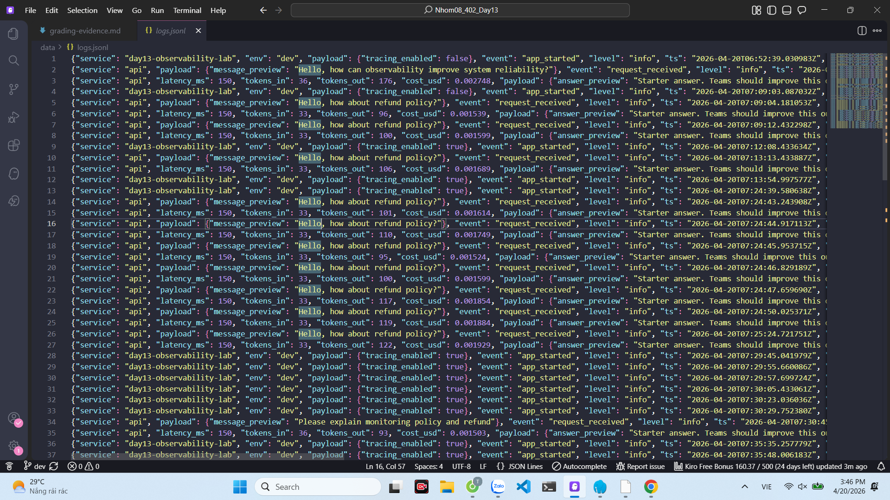
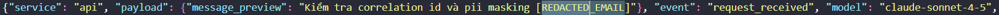
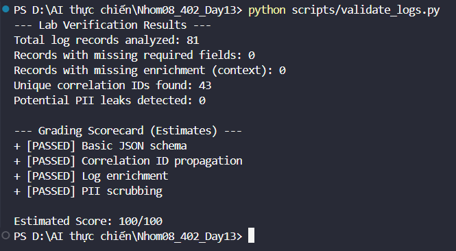

# Evidence Collection Sheet

## Required screenshots (with owner)
- [ ] Langfuse trace list with >= 10 traces (Owner: Member B, Fallback: Member F)
- [ ] One full trace waterfall (Owner: Member B, Fallback: Member F)
- [x] JSON logs showing correlation_id (Owner: Member E)
	- 
- [x] Log line with PII redaction (Owner: Member E)
	- 
- [ ] Dashboard with 6 panels (Owner: Member E, Fallback: Member F)
- [ ] Alert rules with runbook link (Owner: Member C, Fallback: Member F)
- [x] Validation Results (Owner: Member E)
	- 

## D/E to F handover rule
- Nếu `scripts/validate_member_d.py` hoặc `scripts/validate_member_e.py` FAIL trước demo: Member F nhận phần backlog còn thiếu.
- Member F phải ghi rõ phần takeover trong report (`docs/blueprint-template.md`, mục Member F) và đính kèm evidence tương ứng.
- Sau khi takeover, chạy lại gate tổng để xác nhận trạng thái PASS.

## Optional screenshots
- Incident before/after fix
- Cost comparison before/after optimization
- Auto-instrumentation proof
